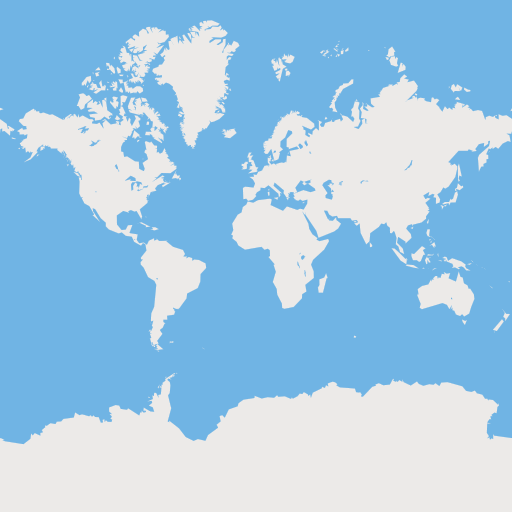
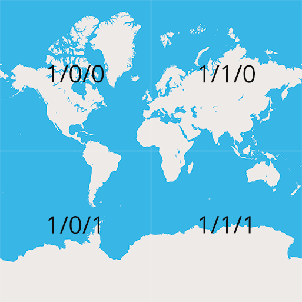

name: inverse
layout: true
class: center, middle, inverse, huge-title

---
# Web Mapping with Leaflet.js


???
Remember to breathe!

`P` for presenter mode.


`C` to open a cloned window.

---
layout: false
class: center, middle
# Devin Clark
## Twitter: [@iDevinClark](http://twitter.com/iDevinClark)
## Blog: [devin-clark.com](http://devin-clark.com)


???
Hi, I am Devin Clark. I am a Web Engineer for Weather Decision Technologies in Norman.

---
layout: false
class: center, middle, inverse, huge-title
# Web Mapping with Leaflet.js

???

---
class: center, middle, inverse, huge-title
## If you have questions
# Interrupt Me

???

---
class: center, middle
# Slides
## [devinclark.github.io/maptime-okc-leaflet](devinclark.github.io/maptime-okc-leaflet)

---
class: center, middle, inverse, huge-title
# Leaflet.js
### An Open-Source JavaScript Library for Mobile-Friendly Interactive Maps

???


---
layout: false
class: center, middle, inverse, huge-title
# Tiles

???
Web maps are made up of many small square images called tiles

---
layout: false
class: center, middle, huge-title
### 1 tile = 256x256px
### # of tiles at zoom level(z) = 4<sup>z</sup>

---
layout: false
class: center, middle
### 4<sup>0</sup> = 1
### 4<sup>1</sup> = 4
### 4<sup>2</sup> = 16
#### ...
### 4<sup>10</sup> = 1,048,576
#### ...
### 4<sup>20</sup> = 1,099,511,627,776

???
* ~1 trillion tiles at 20z
---
layout: false
class: center, middle
### Zoom Level 0


---
layout: false
class: center, middle
### Zoom Level 1


???
So, how do we manage that amount of tiles?

---
layout: false
class: center, middle

## {s}.tiles.mapbox.com/v4/MAPID/**{z}**/{x}/{y}.png

???
This is a tile url. The letters in brackets are variables. Leaflet will fill these in with the correct values. Z is Zoom Level (0-22).

---
layout: false
class: center, middle

## {s}.tiles.mapbox.com/v4/MAPID/{z}/**{x}**/{y}.png

???
X Tile (Horizontal)

---
layout: false
class: center, middle

## {s}.tiles.mapbox.com/v4/MAPID/{z}/{x}/**{y}**.png

???
Y Tile (Vertical)

---
layout: false
class: center, middle


---
layout: false
class: middle, huge-title
# Why Tiles?

* Tiles cache efficiently
* Tiles load progressively
* Tiles are simple to use

???
* caching is good m'kay
* tiles load as you pan (leaflet will load the tiles just outside of the map)
* It is a very simple coordinate system.

---
layout: false
class: center, middle, inverse, huge-title
# GeoJSON

???
* geospatial data format based on json
* point, linestring, polygon, multipoint, multilinestring, multipolygon and geometrycollection

---
layout: false
class: center, middle, huge-title
# GeoJSON is the geographic data format of the web

---
background-image: url(img/llama-geojson.png)
layout: false
class: center, middle, huge-title
#From This...

---
background-image: url(img/llama.png)
layout: false
class: center, middle, huge-title
# To This...

---
background-image: url(img/duck-geojson.png)
layout: false
class: center, middle, inverse, huge-title
# and this...

---
background-image: url(img/duck.png)
layout: false
class: center, middle, inverse, huge-title
# into this...

---
layout: false
class: center, middle, inverse, huge-title
# Hey. I thought this was about Leaflet?

---
layout: false
class: center, middle, inverse, huge-title
# Simple Example
[leaflet only](http://rousseau.io/okcjs-mapping/demo/leaflet.html)

```js
var map = L.map('map')
  .setView([35.478377, -97.519370], 18);

var circle = L.circle([35.478377, -97.519370], 10, {
  color: '#236B8E',
  fillColor: '#236B8E',
  fillOpacity: '0.45'
}).addTo(map);
```

---
layout: false
class: center, middle, inverse, huge-title
# Simple Example
[with basemap tiles](http://rousseau.io/okcjs-mapping/demo/)
```js
var tiles = L.tileLayer(
  'https://{s}.tiles.mapbox.com/v3/MAPID/{z}/{x}/{y}.png'
);
var map = L.map('map')
  .addLayer(tiles)
  .setView([35.478377, -97.519370], 18);
```

---
layout: false
class: center, middle, huge-title


---
layout: false
class: center, middle, inverse, huge-title
# More Examples

---
background-image: url(img/global-obs.png)
layout: false
class: center, middle, inverse, huge-title
### [Surface Observations](http://rousseau.io/okcjs-mapping/demo/turf-obs/obs.html)

---
background-image: url(img/global-obs-2.png)
layout: false
class: center, middle, inverse, huge-title

---
background-image: url(img/conus-hail-z5.png)
layout: false
class: center, middle, inverse, huge-title
### Hail 1955-2014

???
* CSV file from NOAA.
* Total Features: 266295
* Time to Process: 1381

---
background-image: url(img/ok-hail-z8.png)
layout: false
class: center, middle, inverse, huge-title

---
background-image: url(img/global-ltg.png)
layout: false
class: center, middle, inverse, huge-title
### [Global Lightning](http://rousseau.io/okcjs-mapping/demo/turf-obs/obs.html)
#### May 2014

???
* 80,305,421 lightning strikes

---
background-image: url(img/conus-ltg.png)
layout: false
class: center, middle, inverse, huge-title

---
background-image: url(img/ltg-z14.png)
layout: false
class: center, middle, inverse, huge-title

---
layout: false
class: center, middle

### Twitter: [@iDevinClark](http://twitter.com/iDevinClark)
### Blog: [devin-clark.com](http://devin-clark.com)

---
layout: false
# Resources
* [geojson.io](http://geojson.io).
* [mapschool.io](http://mapschool.io).
* [How do web maps work?](https://www.mapbox.com/guides/how-web-maps-work/)
* [Leaflet Examples](http://leafletjs.com/examples.html)
* [Learn GeoJSON by Lyzi Diamond](https://github.com/lyzidiamond/learn-geojson)
* [Maptime Resources](http://maptime.io/lessons-resources/)
* [Visualizing a month of lightning](http://rousseau.io/2015/03/23/visualizing-a-month-of-lightning/)
